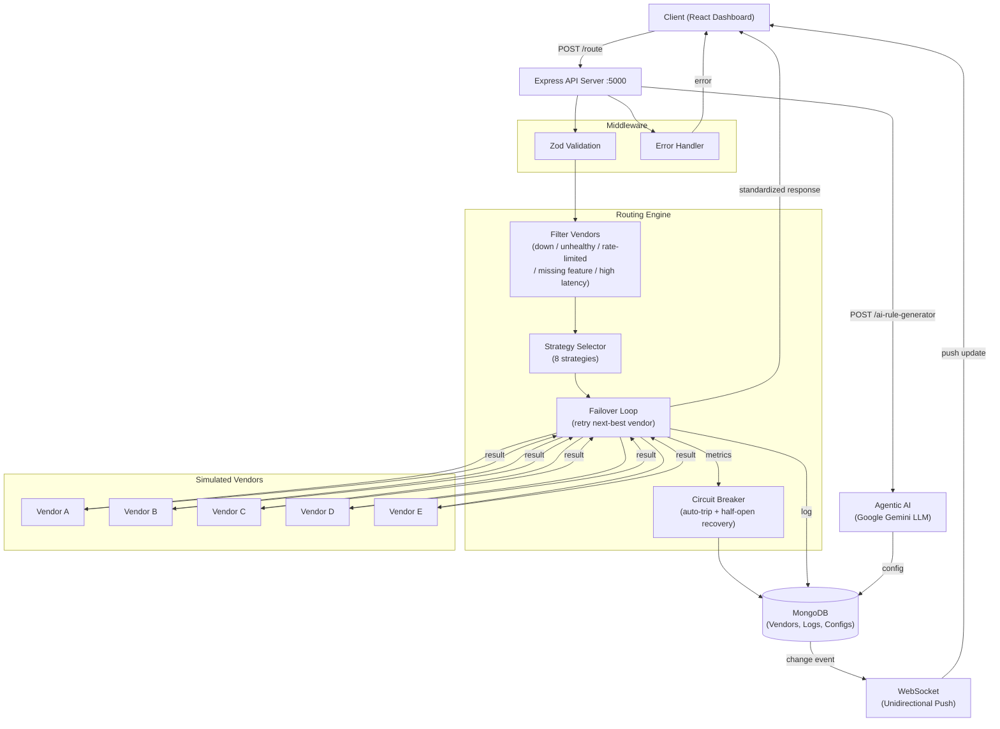

# Intelligent Vendor Routing Platform

> **Assignment 2** — Build a system that exposes one unified API to the client and intelligently routes each request to the best available vendor, so the caller never needs to know which vendor was used.

Modern platforms often depend on multiple third-party vendors for the same capability — KYC verification, OCR, SMS, payment processing, or document validation. Each vendor differs in cost, latency, success rate, rate limits, error rate, availability, and supported features.

This project implements a **full-stack Intelligent Vendor Routing Platform** with:

- A **Node.js + Express** backend that filters, ranks, and routes requests through configurable strategies with automatic failover.
- A **React + Vite** dashboard for managing vendors, testing routes, viewing metrics/logs, and generating AI-powered routing rules.
- **No real vendor APIs** — vendors are simulated with randomized latency/success/failure/timeout outcomes so the routing and failover logic can be exercised end-to-end without external dependencies.

---

## Table of Contents

1. [Architecture Diagram](#architecture-diagram)
2. [Tech Stack](#tech-stack)
3. [Project Structure](#project-structure)
4. [Setup & Installation](#setup--installation)
5. [Sample Vendor Configurations](#sample-vendor-configurations)
6. [Routing Strategies Implemented](#routing-strategies-implemented)
7. [Failover & Circuit Breaker](#failover--circuit-breaker)
8. [API Reference (Mandatory + Bonus)](#api-reference)
9. [Sample API Requests & Responses](#sample-api-requests--responses)
10. [Explanation of Routing Decisions](#explanation-of-routing-decisions)
11. [Real-Time Updates (WebSocket)](#real-time-updates-websocket)
12. [Bonus: Agentic AI](#bonus-agentic-ai)
13. [AI Usage](#ai-usage)
14. [Deliverables Checklist](#deliverables-checklist)

---

## Architecture Diagram

> Full ASCII version available at [`docs/ARCHITECTURE.md`](./docs/ARCHITECTURE.md).



**Request Flow:**

```
Client → POST /route → Zod Validation → Filter Vendors → Strategy Ranking
→ Failover Loop → Vendor A/B/C/D/E → Update Metrics → Log Decision
→ WebSocket Push → Standardized Response → Client
```

The client never knows which vendor was used. The routing engine filters out ineligible vendors, ranks the remaining ones using the selected strategy, then attempts them in order with automatic failover until one succeeds or all are exhausted.

---

## Tech Stack

| Layer | Technology |
|-------|-----------|
| Frontend | React 19 (Vite) + Tailwind CSS v4 + React Router v7 |
| Backend | Node.js + Express.js (MVC + Strategy Design Pattern) |
| Database | MongoDB + Mongoose (MongoDB Atlas cloud / local) |
| Validation | Zod (schema-based request body validation) |
| Real-Time | WebSocket (unidirectional server → client push) |
| AI / LLM | Google Gemini 2.5 Flash (`@google/genai`) |
| Testing | Jest + Supertest + mongodb-memory-server |
| API Docs | Postman collection (`server/postman_collection.json`) |

---

## Project Structure

```
signzy/
├── README.md                    # This file
├── AI_USAGE.md                  # How AI tools were used during development
├── package.json                 # Root scripts (install:all, seed, dev)
│
├── client/                      # React frontend
│   └── src/
│       ├── components/          # Shared UI (Layout, tables, cards, badges, progress bars)
│       ├── pages/               # Dashboard, Vendors, RouteTester, Metrics, Logs,
│       │                        #   Health, AIRuleGenerator, Settings, VendorDetails
│       ├── services/            # Axios API client + WebSocket client
│       ├── hooks/               # useMetrics, useLogs, useHealth (data-fetching hooks)
│       ├── context/             # AppContext (shared vendor list across pages)
│       └── utils/               # Formatting helpers (₹ currency, ms, %)
│
├── server/                      # Express backend
│   ├── config/                  # DB connection, runtime constants
│   ├── controllers/             # Request handlers (vendor, routing, metrics, logs,
│   │                            #   health, ai-rule, routing-config, advice)
│   ├── models/                  # Mongoose schemas (Vendor, RoutingLog, RoutingConfig)
│   ├── routes/                  # Express routers
│   ├── middleware/              # Error handler, Zod validation
│   ├── services/                # routingEngine, vendorSimulator, metricsService,
│   │                            #   loggingService, agentService, strategyAdvisor,
│   │                            #   fallbackAdvisor, socketService
│   ├── strategies/              # 8 strategy files (one per strategy + index registry)
│   ├── utils/                   # asyncHandler, ApiError, filterVendors, rateLimiter,
│   │                            #   computeAvailability, fileLogger, seed
│   ├── tests/                   # Jest + Supertest (integration + unit)
│   ├── logs/                    # routing.log audit trail (flat file, gitignored)
│   └── postman_collection.json  # Postman API collection
│
├── sample_configs/              # Sample JSON files for vendors, rules, AI configs
│   ├── vendors.json
│   ├── routing_rule.json
│   └── ai_generated_config.json
│
└── docs/                        # Detailed documentation
    ├── ARCHITECTURE.md          # Full ASCII architecture diagrams
    ├── ROUTING_DECISIONS.md     # Explanation of every routing strategy decision
    ├── SAMPLE_API.md            # Extended sample API request/response pairs
    └── TEST_EXAMPLES.md         # Dashboard test payloads
```

---

## Setup & Installation

### Prerequisites

- **Node.js** 18+ (tested on v20 and v24)
- **MongoDB** — either a local `mongod` instance or a [MongoDB Atlas](https://cloud.mongodb.com/) cluster
- **Google Gemini API Key** (optional — only needed for the Agentic AI bonus features)

### Quick Start

```bash
# 1. Clone the repository
git clone https://github.com/<your-username>/signzy.git
cd signzy

# 2. Install all dependencies (server + client)
npm run install:all

# 3. Configure environment variables
cp server/.env.example server/.env
# Edit server/.env and set your MONGO_URI (and optionally GEMINI_API_KEY)

# 4. Seed the database with 5 sample vendors + routing logs
npm run seed

# 5. Start both backend (:5000) and frontend (:5173)
npm run dev
```

### Environment Variables (`server/.env`)

| Variable | Default | Description |
|----------|---------|-------------|
| `PORT` | `5000` | Express server port |
| `MONGO_URI` | `mongodb://127.0.0.1:27017/vendor-routing-platform` | MongoDB connection string |
| `CLIENT_URL` | `http://localhost:5173` | CORS allowed origin |
| `GEMINI_API_KEY` | *(empty)* | Google Gemini API key (for AI features) |
| `LATENCY_THRESHOLD_MS` | `2000` | Vendors above this latency are excluded |
| `DEFAULT_TIMEOUT_MS` | `3000` | Fallback timeout for vendor calls |
| `HIGH_ERROR_RATE_THRESHOLD` | `50` | Error rate % to trigger circuit breaker |
| `MIN_SAMPLE_SIZE_FOR_HEALTH_CHECK` | `5` | Min requests before health evaluation |
| `CIRCUIT_BREAKER_COOLDOWN_MS` | `60000` | Cooldown before half-open recovery probe |
| `VENDOR_CACHE_TTL_MS` | `3000` | How long vendor list is cached in memory |

### Running Tests

```bash
cd server && npm test
```

Tests use an **in-memory MongoDB** (`mongodb-memory-server`) — no external database needed.

---

## Sample Vendor Configurations

> Full sample files at [`sample_configs/`](./sample_configs/).

### Vendor A — High-priority PAN + OCR vendor

```json
{
  "name": "Vendor A",
  "priority": 10,
  "weight": 70,
  "costPerRequest": 0.05,
  "timeoutMs": 2000,
  "rateLimitPerMinute": 100,
  "supportedFeatures": ["PAN_VERIFICATION", "OCR"],
  "isActive": true,
  "healthStatus": "healthy"
}
```

### Vendor B — Budget PAN + Document vendor

```json
{
  "name": "Vendor B",
  "priority": 5,
  "weight": 30,
  "costPerRequest": 0.08,
  "timeoutMs": 3000,
  "rateLimitPerMinute": 50,
  "supportedFeatures": ["PAN_VERIFICATION", "DOCUMENT_VALIDATION"],
  "isActive": true,
  "healthStatus": "healthy"
}
```

### Vendor C — Low-cost OCR + SMS vendor

```json
{
  "name": "Vendor C",
  "priority": 3,
  "weight": 20,
  "costPerRequest": 0.02,
  "timeoutMs": 2500,
  "rateLimitPerMinute": 200,
  "supportedFeatures": ["OCR", "SMS"],
  "isActive": true,
  "healthStatus": "healthy"
}
```

### Routing Rule Configuration (AI-generated)

```json
{
  "sourceText": "Use Vendor A for 70% traffic, Vendor B for 30%, but switch to Vendor C if latency crosses 2 seconds or error rate is above 5%.",
  "strategy": "weighted",
  "vendorOrder": ["Vendor A", "Vendor B"],
  "weights": [
    { "vendor": "Vendor A", "percentage": 70 },
    { "vendor": "Vendor B", "percentage": 30 }
  ],
  "conditions": [
    { "metric": "latency", "operator": ">", "value": 2000, "unit": "ms", "action": "switchTo", "vendor": "Vendor C" },
    { "metric": "errorRate", "operator": ">", "value": 5, "unit": "%", "action": "switchTo", "vendor": "Vendor C" }
  ],
  "isActive": true,
  "capability": "PAN_VERIFICATION"
}
```

---

## Routing Strategies Implemented

Eight strategies are implemented (**the assignment asked for at least 3**). Each strategy is a separate file under `server/strategies/`, exposing a `rank(vendors, context)` function (Strategy Design Pattern).

| # | Strategy | File | How It Ranks Vendors |
|---|----------|------|---------------------|
| 1 | **Priority** | `priorityStrategy.js` | Highest `priority` number first |
| 2 | **Weighted** | `weightedStrategy.js` | Random selection proportional to `weight` values |
| 3 | **Round Robin** | `roundRobinStrategy.js` | Cycles through vendors in order (in-memory counter) |
| 4 | **Lowest Latency** | `lowestLatencyStrategy.js` | Lowest `averageLatency` first |
| 5 | **Lowest Cost** | `lowestCostStrategy.js` | Lowest `costPerRequest` first |
| 6 | **Health Based** | `healthBasedStrategy.js` | Composite score: success rate + availability − error rate |
| 7 | **Failover** | `failoverStrategy.js` | Sorted by priority, skip any vendor that is unhealthy |
| 8 | **Feature Based** | `featureBasedStrategy.js` | Vendors supporting the most requested features first |

Before any strategy runs, vendors are **filtered out** if they are:
- Marked `isActive: false` (down)
- Health status is `unhealthy` (circuit breaker tripped)
- Rate limit exceeded (sliding-window check)
- Missing the requested capability/feature
- Current latency exceeds `LATENCY_THRESHOLD_MS`

> See [`server/utils/filterVendors.js`](./server/utils/filterVendors.js) for filtering logic.

If `strategy` is not specified on `/route`, the system defaults to `priority` (or `lowestCost` if `requirements.preferLowCost` is `true`).

---

## Failover & Circuit Breaker

### Automatic Failover

The routing engine implements **automatic failover** in `server/services/routingEngine.js`:

1. The selected strategy ranks all eligible vendors.
2. The engine calls the **top-ranked vendor** via the simulator.
3. If the call **fails, times out, or errors** → the engine immediately tries the **next-best vendor** from the ranked list.
4. This continues until one succeeds or **all vendors are exhausted**.
5. Every attempt (success or failure) is recorded in the `failoverHistory` array returned to the caller.

### Circuit Breaker (Three States)

| State | Behavior |
|-------|----------|
| **Closed** (healthy) | Vendor is available for routing |
| **Open** (unhealthy) | Vendor is excluded — error rate exceeded `HIGH_ERROR_RATE_THRESHOLD` after `MIN_SAMPLE_SIZE_FOR_HEALTH_CHECK` requests |
| **Half-Open** (recovery) | After `CIRCUIT_BREAKER_COOLDOWN_MS` (default 60s), one probe request is allowed. Success → Closed; Failure → back to Open. |

> Implementation: `server/services/metricsService.js`

---

## API Reference

### Mandatory APIs

| Method | Route | Purpose |
|--------|-------|---------|
| `POST` | `/vendors` | Register a new vendor |
| `GET` | `/vendors` | List all registered vendors |
| `POST` | `/route` | Route a request to the best vendor |
| `GET` | `/vendor-metrics` | Per-vendor + aggregate performance metrics |
| `GET` | `/routing-logs` | Paginated & filterable routing decision logs |
| `GET` | `/health` | Server health + DB status + per-vendor health |

### Additional APIs

| Method | Route | Purpose |
|--------|-------|---------|
| `PUT` | `/vendors/:id` | Update a vendor's configuration |
| `DELETE` | `/vendors/:id` | Remove a vendor |
| `GET` | `/vendors/:id` | Get single vendor with full details |
| `GET` | `/routing-logs/:id` | Get a single routing log by ID |
| `POST` | `/ai-rule-generator` | Convert plain-English → routing config JSON (AI) |
| `POST` | `/routing-configs` | Save an AI-generated config & apply to vendors |
| `GET` | `/routing-configs` | List all saved routing configs |
| `GET` | `/strategy-recommendation` | AI-recommended best strategy with reasoning |
| `GET` | `/fallback-suggestions` | Suggest fallback vendor order per capability |
| `POST` | `/agent/explain-routing` | AI plain-English explanation of a routing decision |
| `GET` | `/settings` | Get configurable platform settings |
| `PUT` | `/settings` | Update platform settings at runtime |

---

## Sample API Requests & Responses

> Extended examples with more scenarios at [`docs/SAMPLE_API.md`](./docs/SAMPLE_API.md).

### 1. Route a PAN Verification Request

**Request:**
```bash
curl -X POST http://localhost:5000/route \
  -H "Content-Type: application/json" \
  -d '{
    "capability": "PAN_VERIFICATION",
    "payload": { "pan": "ABCDE1234F", "name": "Rahul Sharma" },
    "requirements": { "maxLatencyMs": 2000, "preferLowCost": true }
  }'
```

**Response** (200):
```json
{
  "success": true,
  "status": "SUCCESS",
  "vendorUsed": "Vendor B",
  "routingReason": "Lowest cost per request (₹0.08) among eligible vendors",
  "latencyMs": 850,
  "cost": 0.08,
  "response": {
    "panStatus": "VALID",
    "nameMatch": true,
    "pan": "ABCDE1234F"
  },
  "requestId": "f47ac10b-58cc-4372-a567-0e02b2c3d479",
  "failoverHistory": [
    {
      "vendor": "Vendor B",
      "reason": "Vendor processed the request successfully",
      "latencyMs": 850,
      "status": "success"
    }
  ]
}
```

### 2. Route with Explicit Strategy and Conditions

**Request:**
```bash
curl -X POST http://localhost:5000/route \
  -H "Content-Type: application/json" \
  -d '{
    "capability": "PAN_VERIFICATION",
    "strategy": "weighted",
    "payload": { "pan": "ABCDE1234F", "name": "Rahul Sharma" },
    "conditions": [
      { "metric": "latency", "operator": ">", "value": 2000, "vendor": "Vendor C" }
    ]
  }'
```

**Response** (200):
```json
{
  "success": true,
  "status": "SUCCESS",
  "vendorUsed": "Vendor A",
  "routingReason": "Selected via weighted random selection (weight=70)",
  "latencyMs": 420,
  "cost": 0.05,
  "response": {
    "panStatus": "VALID",
    "nameMatch": true,
    "pan": "ABCDE1234F"
  },
  "requestId": "a1b2c3d4-e5f6-7890-abcd-ef1234567890",
  "failoverHistory": [
    {
      "vendor": "Vendor A",
      "reason": "Vendor processed the request successfully",
      "latencyMs": 420,
      "status": "success"
    }
  ]
}
```

### 3. Generate Routing Config from Natural Language (AI)

**Request:**
```bash
curl -X POST http://localhost:5000/ai-rule-generator \
  -H "Content-Type: application/json" \
  -d '{
    "text": "Use Vendor A for 70% traffic, Vendor B for 30%, but switch to Vendor C if latency crosses 2 seconds or error rate is above 5%."
  }'
```

**Response** (200):
```json
{
  "success": true,
  "data": {
    "strategy": "weighted",
    "vendorOrder": ["Vendor A", "Vendor B"],
    "weights": [
      { "vendor": "Vendor A", "percentage": 70 },
      { "vendor": "Vendor B", "percentage": 30 }
    ],
    "conditions": [
      { "metric": "latency", "operator": ">", "value": 2000, "unit": "ms", "action": "switchTo", "vendor": "Vendor C" },
      { "metric": "errorRate", "operator": ">", "value": 5, "unit": "%", "action": "switchTo", "vendor": "Vendor C" }
    ],
    "sourceText": "Use Vendor A for 70% traffic, Vendor B for 30%, but switch to Vendor C if latency crosses 2 seconds or error rate is above 5%."
  }
}
```

### 4. Get Vendor Metrics

**Request:**
```bash
curl http://localhost:5000/vendor-metrics
```

**Response** (200):
```json
{
  "success": true,
  "summary": {
    "totalVendors": 5,
    "healthyVendors": 4,
    "totalRequests": 4656,
    "successRate": 92.5,
    "averageLatency": 456,
    "totalCost": 225.62
  },
  "vendors": [
    {
      "name": "Vendor A",
      "healthStatus": "healthy",
      "isActive": true,
      "costPerRequest": 0.05,
      "metrics": {
        "totalRequests": 1252,
        "successfulRequests": 1244,
        "failedRequests": 8,
        "averageLatency": 122,
        "errorRate": 0.6,
        "successRate": 99.4,
        "availabilityPercentage": 100,
        "totalCostSpent": 62.60
      }
    }
  ]
}
```

### 5. Get Routing Logs (Paginated + Filtered)

**Request:**
```bash
curl "http://localhost:5000/routing-logs?page=1&limit=8&strategy=weighted&status=SUCCESS"
```

**Response** (200):
```json
{
  "success": true,
  "data": [
    {
      "requestId": "f47ac10b-58cc-4372-a567-0e02b2c3d479",
      "timestamp": "2026-07-04T12:30:00.000Z",
      "capability": "PAN_VERIFICATION",
      "selectedVendor": "Vendor A",
      "routingStrategy": "weighted",
      "routingReason": "Selected via weighted random selection (weight=70)",
      "failoverHistory": [
        { "vendor": "Vendor A", "reason": "Vendor processed the request successfully", "latencyMs": 420, "status": "success" }
      ],
      "latencyMs": 420,
      "cost": 0.05,
      "finalStatus": "SUCCESS"
    }
  ],
  "pagination": { "total": 120, "page": 1, "limit": 8, "totalPages": 15 }
}
```

### 6. Health Check

**Request:**
```bash
curl http://localhost:5000/health
```

**Response** (200):
```json
{
  "success": true,
  "server": "ok",
  "database": "connected",
  "timestamp": "2026-07-05T02:30:00.000Z",
  "vendors": [
    {
      "name": "Vendor A",
      "isActive": true,
      "healthStatus": "healthy",
      "currentLatency": 122,
      "successRate": 99.4,
      "availabilityPercentage": 100
    },
    {
      "name": "Vendor D",
      "isActive": true,
      "healthStatus": "unhealthy",
      "currentLatency": 1252,
      "successRate": 44.7,
      "availabilityPercentage": 0
    }
  ]
}
```

---

## Explanation of Routing Decisions

> Detailed deep-dive at [`docs/ROUTING_DECISIONS.md`](./docs/ROUTING_DECISIONS.md).

Every `/route` response includes two key fields that explain the routing decision:

### `routingReason` — Why was this vendor chosen?

| Strategy | Example Reason |
|----------|---------------|
| Priority | `"Highest priority vendor (priority=10)"` |
| Weighted | `"Selected via weighted random selection (weight=70)"` |
| Round Robin | `"Round-robin selection (position 3 of 5)"` |
| Lowest Latency | `"Lowest average latency (122ms) among eligible vendors"` |
| Lowest Cost | `"Lowest cost per request (₹0.02) among eligible vendors"` |
| Health Based | `"Best health score (successRate=99.4%, availability=100%)"` |
| Failover | `"Primary vendor failed, failover to next available"` |
| Feature Based | `"Supports most requested features (3/3)"` |

### `failoverHistory` — Full audit trail

Every vendor attempt (success, failure, timeout, skip) is recorded:

```json
"failoverHistory": [
  { "vendor": "Vendor A", "reason": "Vendor timed out after 2000ms", "latencyMs": 2000, "status": "timeout" },
  { "vendor": "Vendor B", "reason": "Vendor processed the request successfully", "latencyMs": 340, "status": "success" }
]
```

This shows the interviewer exactly how automatic failover works — Vendor A timed out, so the system automatically retried with Vendor B, which succeeded.

---

## Real-Time Updates (WebSocket)

The platform uses **unidirectional WebSocket** (server → client push only) to keep the dashboard in sync without polling:

- **Path:** `ws://localhost:5000/ws`
- **Direction:** Server pushes events; client only listens (no client-to-server messages)
- **Events pushed:**
  - `LOG_UPDATE` — when a new routing decision is logged
  - `TELEMETRY_REFRESH` — when vendor metrics change
  - `CONNECTED` — initial handshake on connection

The React dashboard automatically reconnects with a 3-second backoff if the WebSocket connection drops.

---

## Bonus: Agentic AI

All AI features use the **Google Gemini 2.5 Flash** LLM via `@google/genai`. They are **fully optional** — the platform works without a `GEMINI_API_KEY`.

| Feature | API | Description |
|---------|-----|-------------|
| **Generate routing config from plain English** | `POST /ai-rule-generator` | Converts natural language like *"Use Vendor A for 70% traffic, Vendor B for 30%, but switch to Vendor C if latency crosses 2 seconds"* into a valid JSON routing configuration with strategy, weights, and conditions. |
| **Explain why a vendor was selected** | `POST /agent/explain-routing` | Reads a complex JSON routing audit log and generates a plain-English 2-3 sentence explanation of exactly what happened during that request. |
| **Recommend the best routing strategy** | `GET /strategy-recommendation` | Analyzes current vendor latency/cost/health spread and recommends the optimal strategy with reasoning. |
| **Suggest fallback rules** | `GET /fallback-suggestions` | Aggregates real routing-log history per capability and suggests a reliability-ordered fallback chain. |
| **Detect unhealthy vendors** | Automatic | Circuit breaker in `metricsService.js` flags vendors unhealthy once their rolling error rate crosses a threshold, with half-open recovery after cooldown. |

### Example: Plain English → Routing Config

**Input:**
> "Use Vendor A for 70% traffic, Vendor B for 30%, but switch to Vendor C if latency crosses 2 seconds or error rate is above 5%."

**AI Output:**
```json
{
  "strategy": "weighted",
  "vendorOrder": ["Vendor A", "Vendor B"],
  "weights": [
    { "vendor": "Vendor A", "percentage": 70 },
    { "vendor": "Vendor B", "percentage": 30 }
  ],
  "conditions": [
    { "metric": "latency", "operator": ">", "value": 2000, "unit": "ms", "action": "switchTo", "vendor": "Vendor C" },
    { "metric": "errorRate", "operator": ">", "value": 5, "unit": "%", "action": "switchTo", "vendor": "Vendor C" }
  ]
}
```

---

## AI Usage

See [`AI_USAGE.md`](./AI_USAGE.md) for full details on how AI tools were used during development, including:

- Architecture & design review
- Routing engine development assistance
- AI rule generator & agentic feature integration
- Testing & debugging
- Frontend component structure

---

## Deliverables Checklist

| # | Deliverable | Location | Status |
|---|-------------|----------|--------|
| 1 | **Source code** | [`server/`](./server/) (backend) + [`client/`](./client/) (frontend) | ✅ |
| 2 | **README** | This file ([`README.md`](./README.md)) | ✅ |
| 3 | **Sample vendor configs** | [`sample_configs/vendors.json`](./sample_configs/vendors.json) | ✅ |
| 4 | **Sample API requests/responses** | [Above](#sample-api-requests--responses) + [`docs/SAMPLE_API.md`](./docs/SAMPLE_API.md) | ✅ |
| 5 | **Architecture diagram** | [Above](#architecture-diagram) (Mermaid) + [`docs/ARCHITECTURE.md`](./docs/ARCHITECTURE.md) (ASCII) | ✅ |
| 6 | **Explanation of routing decisions** | [Above](#explanation-of-routing-decisions) + [`docs/ROUTING_DECISIONS.md`](./docs/ROUTING_DECISIONS.md) | ✅ |
| 7 | **AI_USAGE.md** | [`AI_USAGE.md`](./AI_USAGE.md) | ✅ |

### Additional Deliverables (Beyond Requirements)

| Deliverable | Location |
|-------------|----------|
| Sample routing rule config | [`sample_configs/routing_rule.json`](./sample_configs/routing_rule.json) |
| AI-generated config example | [`sample_configs/ai_generated_config.json`](./sample_configs/ai_generated_config.json) |
| Dashboard test payloads | [`docs/TEST_EXAMPLES.md`](./docs/TEST_EXAMPLES.md) |
| Postman collection | [`server/postman_collection.json`](./server/postman_collection.json) |
| Automated tests | `server/tests/` — run with `cd server && npm test` |
| Full React dashboard | 10 pages — Dashboard, Vendors, Route Tester, Metrics, Logs, Log Details, Health, AI Rule Generator, Settings, Vendor Details |
| WebSocket real-time push | Unidirectional server → client telemetry |
